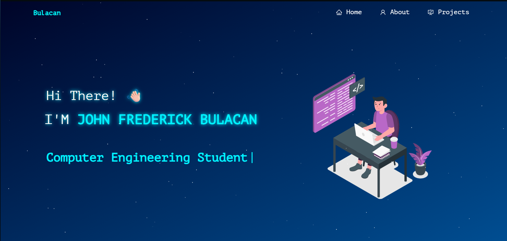

# John Frederick Bulacan | Computer Engineering Portfolio

---

 &nbsp;
 &nbsp;

## About Me

I'm a **Computer Engineering student at the Technological Institute of the Philippines (TIP) Manila** with a passion for designing robust systems and building full-stack web applications. I serve as a **UNOCT Project Implementation Member** contributing to **Building Safer Online Gaming Communities**, focusing on digital citizenship and cybersecurity awareness. Additionally, I completed the **ASEAN Foundation AI Training Program**, expanding my expertise in emerging technologies. This portfolio showcases projects developed during my academic journey and professional collaborations.

## Project Highlights

This portfolio showcases my professional and academic work:

- **Building Safer Online Gaming Communities (UNOCT)** - Project Implementation Member contributing to digital citizenship and online safety initiatives
- **ASEAN Foundation AI Training** - Advanced training in artificial intelligence and emerging technologies
- **DLC (Digital Learning Commons)** - Educational content management system
- **Student Login System** - Secure authentication portal with role-based access control
- **Enrollment Portal** - Student registration and course enrollment platform

## Tech Stack

**Frontend & Full-Stack Development**
- React.js
- Node.js
- CSS3
- JavaScript (ES6+)

**Networking & Systems**
- Cisco Packet Tracer
- Cisco Network Tools

**Engineering & Simulation**
- MATLAB

**Development Tools**
- Visual Studio Code
- Git & GitHub
- Vercel (Deployment)

## Features

**📖 Multi-Page Layout**

**🎨 Styled with React-Bootstrap and Css with easy to customize colors**

**📱 Fully Responsive**

## Getting Started

Clone down this repository. You will need `node.js` and `git` installed globally on your machine.

## 🛠 Installation and Setup Instructions

1. Installation: `npm install`

2. In the project directory, you can run: `npm start`

Runs the app in the development mode.\
Open [http://localhost:3000](http://localhost:3000) to view it in the browser.
The page will reload if you make edits.

## Usage Instructions

Open the project folder and Navigate to `/src/components/`.  
You will find all the components used and you can edit your information accordingly.

## Connect With Me

Feel free to explore my projects and reach out for collaboration opportunities!
